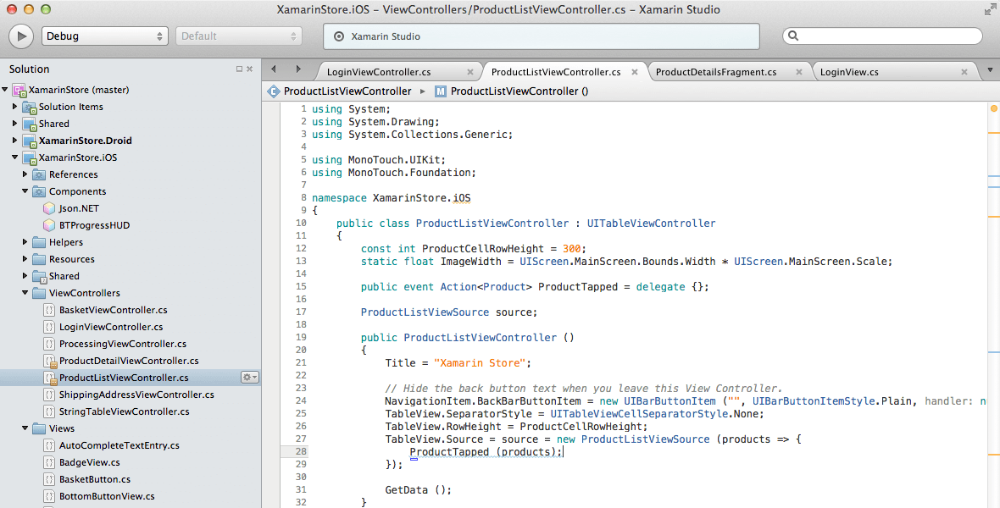
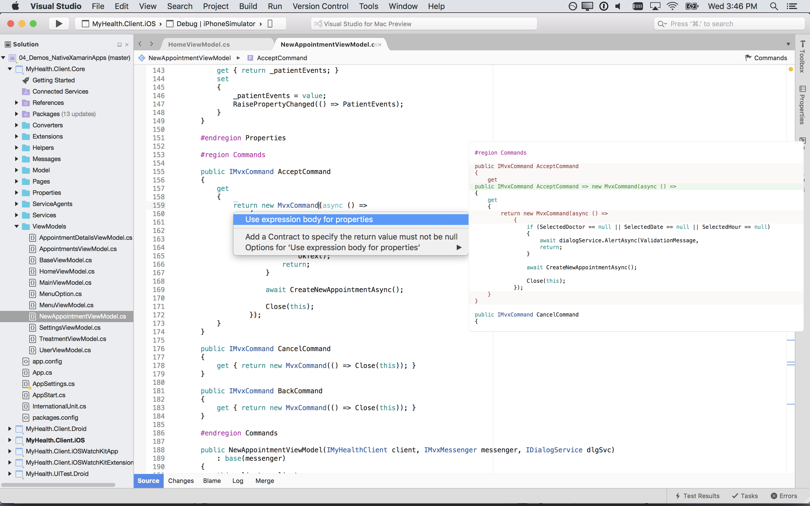
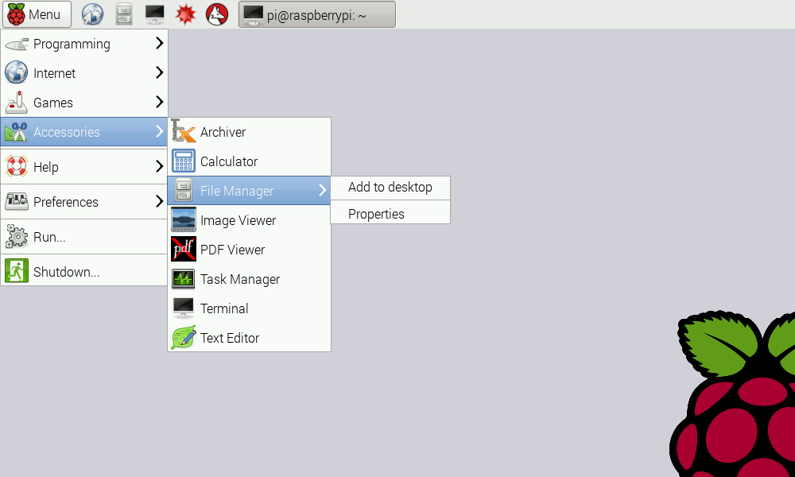
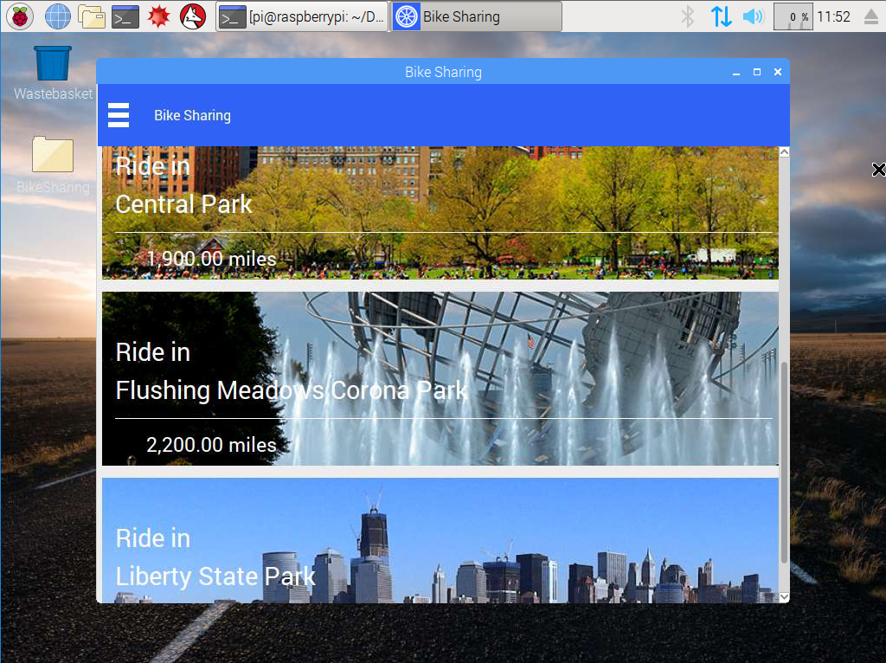

# How can I try?

If you want to **try** everything, let's see how to compile and test on each platform.

## Compile the source code

**Synchronizes** the latest version of the [gtk branch](https://github.com/jsuarezruiz/Xamarin.Forms/tree/gtk). Open the Xamarin.Forms.sln. Then, **compile** the source code. In the Output of the project **Xamarin.Forms.Platform.GTK** you can find the libraries:

- Xamarin.Forms.Core
- Xamarin.Forms.Xaml
- Xamarin.Forms.Platform
- Xamarin.Forms.Platform.GTK

## Deploy

### Linux

The package repository hosts the packages you need, add it with the following commands.

    sudo apt-key adv --keyserver hkp://keyserver.ubuntu.com:80 --recv-keys 3FA7E0328081BFF6A14DA29AA6A19B38D3D831EF
    echo "deb http://download.mono-project.com/repo/ubuntu xenial main" | sudo tee /etc/apt/sources.list.d/mono-official.list
    sudo apt-get update

To install Mono:

    sudo apt-get install mono-devel

The Mono package includes: Mono Runtime, Gtk#, etc.

Open the output of a Xamarin.Forms GTK# Backend application and run:

    mono Xamarin.Forms.App.GTK.exe

If you plan on developing applications, we suggest that you also install the [MonoDevelop](http://www.monodevelop.com) IDE after you install Mono.

### MacOS

Mono supports Mac OS X version 10.7 (Lion) and later. [Download](http://www.mono-project.com/download/) the latest MacOS package.

The Mono package includes: Mono Runtime, Gtk#, etc.

Open the output of a Xamarin.Forms GTK# Backend application and run:

    mono Xamarin.Forms.App.GTK.exe

If you plan on developing applications, we suggest that you also install the [Visual Studio macOS](https://www.visualstudio.com/vs/visual-studio-mac/) IDE after you install Mono.

### Raspberry PI

Raspberry Pi is capable of running a full Linux distribution. One of the most used options is [Raspbian](https://www.raspberrypi.org/downloads/raspbian/).

To install Mono on the Raspberry use:

    sudo apt-get install mono-complete

Then you need to install the bindings between Mono and GTK:

    sudo apt-get install gtk-sharp2

Copy the output of a Xamarin.Forms GTK# Backend application and run:

    mono Xamarin.Forms.App.GTK.exe

### Windows

Mono runs on Windows, [download](http://www.mono-project.com/download/) the latest Windows installer from the download page.

Gtk# is included as part of the Mono installation.

Open the output of a Xamarin.Forms GTK# Backend application and double clic the .exe file.